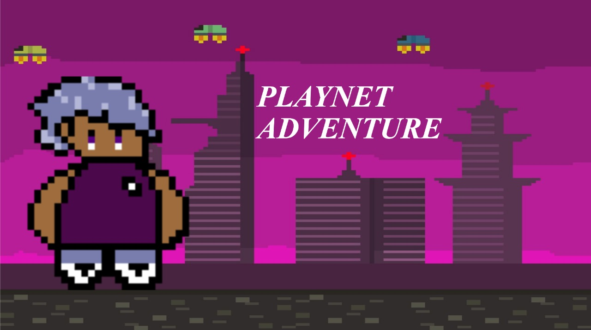
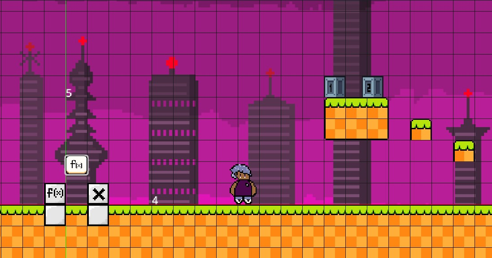

# 🕹️ Playnet Adventure - O Futuro (Quase) Sem Bugs 🌌

Bem-vind@ ao repositório do jogo **Playnet Adventure**! Prepare-se para uma aventura épica no ano 2708, onde tudo é digital... e um vírus maluco está tentando dominar o mundo. Mas, calma, temos o herói certo para essa missão: o lendário **Error 504**. Ele talvez não seja perfeito, mas é tudo o que temos!

<div align="center">
  
</div>

---

## 📜 História do Jogo

Em 2708, a vida acontece em uma gigantesca rede conhecida como **Gan**. Parece ótimo, até que... um vírus maligno toma conta e tenta transformar tudo em um caos digital! Mas o nosso herói **Error 504** (sim, ele tem o nome de um erro) está pronto para salvar o mundo, enfrentar bugs e derrotar o chefão. O jogador passa por várias fases, enfrenta perigos e bugs (alguns são intencionais!) para chegar ao chefão e salvar o mundo... ou pelo menos tentar.

## 🎮 Sobre o Jogo

Este é um jogo de plataforma onde o jogador precisa:
- 🧗‍♂️ Passar por fases desafiadoras,
- 💥 Destruir bugs (os que aparecem na tela, não no código... esperamos),
- 🏆 Derrotar o chefão final e salvar a **Gan**.

## 🤓 Tecnologias e Ferramentas

- **Godot Engine** para desenvolvimento do jogo
- **GD Script** para toda a programação (uma linguagem que só fica um pouquinho irritada quando você erra a sintaxe)
- **Piskel** para os sprites, background e outras partes visuais do jogo (porque nem só de código vive um herói digital!)

## 📂 Estrutura do Projeto

Aqui vai uma pequena navegação pelo que você encontrará neste repositório:

```
📦 Playnet-Adventure
├── 📁 art assets             # Aqui estão os arquivos visuais (sprites, backgrounds, efects etc.)
├── 📁 scripts                # Código GD Script que move o Error 504 e que faz as fases acontecerem
├── 📁 personagens            # O Error 504 e os principasi inimigos estão aqui
├── 📁 scenes                 # Aqui você pode encontrar as fases dos jogos e alguns objetos 
└── 📁 site                   # A página web, com os arquivos JS e CSS, além da página auxiliar
└── ⚙️ Playnet Adventure.exe  # Executável para Windows.
```

Aqui está o README atualizado com as alterações sugeridas:

---

## 🖥️ Requisitos do Sistema

**Compatível com:**  
- **⊞ Windows**  

---

## 🚀 Como Jogar

1. **Baixe o jogo:** basta clicar no link do footer da página principal. Vai cair um .exe no seu computador mais rápido do que um bug sendo corrigido na última hora! [Link do Playnet Adventure](Site/Playnet_Adventure.exe) ou acesse o [Site](https://playnet-adventure.vercel.app/) e veja alguns detalhes e histórias, além de ter o link de dowloand lá também.

2. **Inicie o jogo:** abra o `.exe`, espere um pouco (prometemos que o Error 504 não estará no processo de inicialização) e mergulhe no mundo de 2708.

3. **Divirta-se!** Passe as fases, enfrente desafios e faça de tudo para evitar ser "desconectado". Lembre-se: você é o **Error 504** - o destino do mundo está nas suas mãos (ou quase isso).


## ⚔️ Fases

1. **Primeira Fase**: Desvende o plano cartesiano e avance pelos desafios matemáticos.
2. **Segunda Fase**: Enfrente uma batalha naval em um círculo trigonométrico, guiado pelo famoso matemático Malba Tahan!

## 👥 Equipe de Desenvolvimento

Esse projeto foi desenvolvido por um grupo incrível de pessoas, cada uma responsável por trazer um pouco de mágica e uma pitada de sanidade a este jogo caótico.

- **Almir Cesar** - (Site e parte da lógica)
- **Fábio Benjamin** - (Desing do personagem e história)
- **Lucas Guidi** - (Lógica)
- **Thiago Pereira** - (Lógica)
- **Vitor Bueno** - (Desing do jogo e história)

## 🖼️ Screenshots do Jogo

Quer ver o jogo em ação antes de baixar? Aqui vão algumas imagens do que espera por você!

  <div align="center" padding="">
    
    
    
  </div>

---

## 🛠️ Contribuindo

Se você encontrou um bug, ótimo! Quer dizer, não ótimo pra gente, mas gostamos de saber. Faça um fork, resolva o bug, e envie um pull request. Nossa equipe (não exatamente de robôs do ano 2708) vai revisar e adicionar as suas mudanças!

---

## 🧠 Dicas Úteis

- **Se o Error 504 parar de responder**... bem, ele é um erro, então talvez seja normal.
- **Colecione os itens escondidos** - algumas fases têm segredos que só os melhores jogadores encontrarão.
- **Leve o tempo que precisar** - nada de quebrar o teclado porque o boss é muito difícil!

---

## 🌟 Feedback

Amou o jogo? Encontrou um bug de verdade? Quer mandar uma mensagem pra nossa equipe? Fique à vontade para abrir uma *Issue* aqui no GitHub.

---

Divirta-se em **Playnet Adventure** e lembre-se: o destino da **Gan** está em suas mãos!
